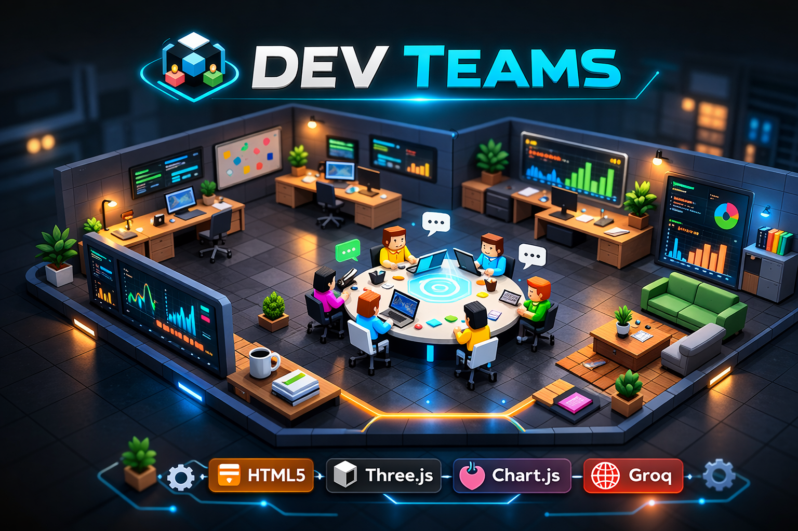
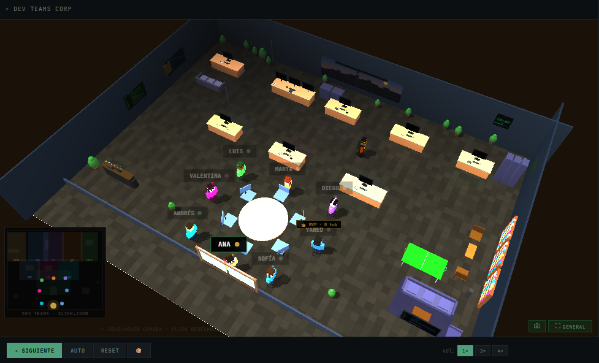

# Dev Teams


Dev Teams es una experiencia visual de operaciones en una oficina 3D donde un equipo de agentes simula reuniones, tareas, actividad operativa y conversacion asistida por IA.



## Vista General

El proyecto combina una escena 3D, paneles operativos y acciones de equipo dentro de una sola interfaz. Puede funcionar en `demo mode` o conectarse a `Groq` para respuestas reales desde el chat.

## Capturas

### Vision General



## Que Hace

- Muestra un equipo de trabajo dentro de una oficina 3D interactiva.
- Ejecuta reuniones y acciones coordinadas entre agentes.
- Permite asignar tareas y visualizar actividad operativa.
- Incluye chat con modo demo y modo conectado por API.
- Presenta paneles de estado, eventos y seguimiento visual.

## Que Hace Cada Parte

- `Escena 3D`: muestra a los agentes, sus movimientos y eventos en tiempo real.
- `Reunion`: lleva al equipo a la mesa central para una reunion de trabajo.
- `Demo`: ejecuta un recorrido guiado para mostrar el flujo principal.
- `Tarea`: permite asignar una accion a uno o varios agentes.
- `Chat`: permite hablar con un agente o con todo el equipo.
- `Command Center`: resume actividad reciente, eventos y estado operativo.
- `Status / Dashboard`: presenta informacion visual del estado general.

## Como Colocar La API Key

1. Abre la aplicacion.
2. En la barra superior, abre la configuracion de API.
3. Pega tu `Groq API Key`.
4. Selecciona el modelo que quieres usar.
5. Guarda los cambios.
6. Si todo esta correcto, la interfaz cambia de `demo mode` a `groq conectado`.

Notas:

- La clave se guarda en la sesion actual del navegador.
- El modelo seleccionado se recuerda localmente.
- No subas tu API key al repositorio ni la dejes escrita en el codigo.

## Como Ejecutarlo

Opcion recomendada:

```bash
python -m http.server 5500
```

Luego abre:

```text
http://localhost:5500
```

Tambien puedes abrir `index.html` directamente, aunque un servidor local suele evitar problemas menores de carga.

## Stack

- `HTML`
- `CSS`
- `JavaScript`
- `three.js`
- `Chart.js`
- `Groq API`

## Estado Actual

Proyecto en fase `alpha`, orientado a demo visual, validacion de concepto y evolucion del flujo operativo.
