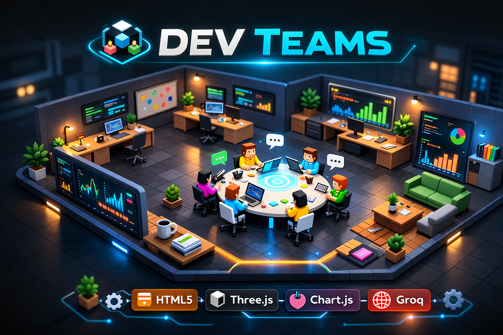

# Dev Teams · AI Pentest Lab


Un laboratorio 3D interactivo de pentesting etico con ocho agentes de IA. La simulacion trabaja con alcance autorizado, evidencia reproducible, remediacion y retest; funciona en modo demo sin credenciales y escala a respuestas reales al conectar Groq.

---

## Vista general



---

## Qué incluye

### Escena 3D
- Ocho agentes con personalidad, rol y area de trabajo propia: Ana (Security Director), Sofia (Pentest Program Manager), Yared (Red Team), Diego (AppSec), Marta (Vulnerability Validation), Luis (Cloud Security), Valentina (Threat Modeling) y Andres (Threat Intelligence)
- Flujo de pentest autorizado: scope, reconocimiento controlado, AppSec, validacion, inteligencia, remediacion y retest
- Pathfinding A* con Web Worker
- Sombras dinámicas, ciclo día/noche, modo FPS, clima real de Cartagena vía Open-Meteo
- Eventos ambientales: briefing, revision de evidencia, threat modeling y visitante Paula

### Panel lateral
- **Árbol** — jerarquía del equipo con estado en tiempo real
- **Flujo** — pasos MCP por agente con métricas de tokens y costo
- **Consola** — chat individual o broadcast inteligente
- **Estado** — actividad global con gráfica de 60 segundos
- **Dashboard** — KPIs ejecutivos, decisiones compartidas y salud operativa

### Chat y multiagente
- Routing automático al agente más relevante por tema
- Planner interno para consultas complejas
- Delegación entre roles con flechas de flujo
- Compresión automática de memoria cuando el historial crece
- Modo broadcast: selecciona los roles adecuados en lugar de disparar a todos

### Workspace (File System Access API)
- Conexión a carpeta local sin subir nada a ningún servidor
- Lectura de `.txt`, `.md`, `.json`, `.js`, `.ts`, PDF, Excel y Word
- Búsqueda en texto plano a través del proyecto
- Análisis de archivos por rol activo usando Groq

---

## Últimas Optimizaciones (Performance & UI)

- **Modo Claro / Oscuro completo:** Toggle integrado en la cabecera (`#themeBtnHdr`) para cambiar instantáneamente entre tema claro y oscuro, con persistencia automática en `localStorage` y sincronización dinámica de iconos/textos del botón.
- **Diseño espacioso y sin apiñamiento:** Rediseño visual del panel lateral (sidebar) aumentando márgenes, gaps y el padding de tarjetas, botones (`.cas-btn`), nodos del árbol (`.tnode`) y la consola de comandos, eliminando por completo la sensación de saturación.
- **Escena 3D sin obstrucciones:** Remoción total de los degradados (*vignettes*) oscuros y claros del canvas en la parte superior e inferior (`.cwrap::before` y `.cwrap::after`), eliminando cualquier efecto de neblina o humo blanco y maximizando la visibilidad del escenario desde cualquier perspectiva.
- **Refactorización modular:** Extracción completa de CSS y JavaScript de `index.html` a archivos independientes y reutilizables (`js/agents.js`, `js/chat.js`, `js/workspace.js`, `js/ui.js` y `css/styles.css`), mejorando drásticamente la mantenibilidad.
- **Control de concurrencia y timeout:** Integración de `AbortController` con un límite de 30 segundos en la función `groq()`, gestionando de forma segura y eficiente llamadas simultáneas al LLM y protegiendo el uso de la API key.
- **Carga optimizada:** Renderizado inicial asíncrono (*chunking*) para evitar congelamientos en la pantalla de bienvenida.
- **Cero Lag (Shaders):** Pre-alojamiento de luces dinámicas de eventos para evitar pesadas recompilaciones en Three.js.
- **FPS estables:** Distribución de carga matemática (*staggering*) al actualizar texturas de monitores para garantizar fluidez.
- **Mejor iluminación:** Escena 10% más clara y vibrante (`LinearToneMapping`) con código Three.js modernizado y sin *warnings*.
- **UI Glassmorphism:** Rediseño total de modales y popups con bordes redondeados, sombras profundas y desenfoque de fondo.

---

## Cómo ejecutar

Cualquier servidor estático local funciona. La forma más rápida:

```bash
python -m http.server 5500
```

Luego abre `http://localhost:5500` en el navegador.

También puedes usar Live Server, Vite, npx serve o cualquier equivalente.

> **Nota:** para los comandos de workspace (`/carpeta`, `/leer`, etc.) necesitas un navegador basado en Chromium. Firefox no soporta `showDirectoryPicker` todavía.

---

## Conectar Groq

1. Abre la app y pulsa el botón **API** en la cabecera.
2. Elige el modelo desde el selector.
3. Pega tu API key (la consigues gratis en [console.groq.com](https://console.groq.com)).
4. Pulsa **Guardar**.

La app valida la key con una llamada real antes de confirmar la conexión. Si falla, vuelve a modo demo automáticamente. La key se guarda en `sessionStorage` y nunca toca ningún backend propio.

### Modelos disponibles

| Identificador | Descripción |
|---|---|
| `openai/gpt-oss-120b` | Modelo principal para análisis y razonamiento |
| `openai/gpt-oss-20b` | Variante rápida y ligera |
| `llama-3.3-70b-versatile` | Llama 3.3 equilibrado (70B) |
| `llama-3.1-8b-instant` | Respuestas rápidas de baja latencia |
| `qwen/qwen3.6-27b` | Preview para lógica y código |
| `openai/gpt-oss-safeguard-20b` | Modelo orientado a salvaguardas |
| `google/gemma-4-31b-it:free` | Gemma 4 vía OpenRouter |

---

## Comandos del chat

Escribe cualquiera de estos directamente en el input de la consola:

```
/carpeta          Conecta una carpeta local
/indexar          Reconstruye el índice de archivos
/archivos         Lista los archivos detectados
/leer ruta        Lee un archivo y lo abre en el visor
/buscar texto     Busca coincidencias en el workspace
/analizar ruta    Analiza un archivo con Groq desde el rol activo
/exportar         Descarga el chat actual como .txt
```

El mini menú de herramientas en la consola expone las mismas acciones sin tener que escribir comandos.

---

## Atajos de teclado

| Tecla | Acción |
|---|---|
| `Space` | Siguiente paso del flujo |
| `R` | Reset de la simulación |
| `M` | Iniciar reunión de equipo |
| `F` | Activar / salir de modo FPS |
| `N` | Alternar día / noche |
| `A` | Auto play del flujo activo |
| `C` | Resetear cámara |
| `?` | Mostrar atajos |
| `Esc` | Cerrar modales / salir de FPS |

---

## Estructura del proyecto

```
.
├── index.html          # Estructura HTML y contenedores de UI
├── css/
│   └── styles.css      # Estilos visuales (Layout, Animaciones, responsive y efectos premium)
├── js/
│   ├── agents.js       # Lógica e inicialización de agentes, simulación 3D y pathfinding
│   ├── chat.js         # Consola de chat, integraciones con Groq API, planner y mensajería
│   ├── ui.js           # Renderizado de componentes UI, dashboard, atajos y control de modales
│   └── workspace.js    # Acceso a archivos locales y tools del workspace (File System Access)
└── README.md
```

La app ha sido refactorizada para ser modular y mantenible, extrayendo el CSS y JS embebido del `index.html` original hacia archivos independientes. No hay build step, no hay dependencias npm, no hay backend. Todo lo que necesitas está en los archivos de la carpeta `js/` y `css/` y en las CDN declaradas en el `index.html`.

---

## Stack

- **Three.js r128** — escena 3D, materiales, luces y sombras
- **Chart.js 4** — métricas en el panel de estado
- **PDF.js** — lectura de archivos PDF locales
- **SheetJS (xlsx)** — lectura de hojas de cálculo
- **Mammoth.js** — extracción de texto de archivos Word
- **Groq API** — inferencia LLM de baja latencia (Llama 4, DeepSeek R1, Qwen 3)
- **OpenRouter** — acceso a modelos gratuitos (Gemma 4, Qwen Coder)
- **File System Access API** — acceso a carpetas locales sin subir archivos
- **Web Workers** — pathfinding A* fuera del hilo principal
- **Web Speech API** — entrada de voz en la consola

---

## Persistencia

| Dato | Dónde se guarda |
|---|---|
| API key | `sessionStorage` (no persiste entre sesiones) |
| Tema seleccionado (Claro/Oscuro) | `localStorage` |
| Modelo seleccionado | `localStorage` |
| Historial de chat por agente | `localStorage` |
| Historial de reuniones | `localStorage` |
| Historial de tareas | `localStorage` |
| XP y niveles | `localStorage` |
| Logros | `localStorage` |
| Notas del pizarrón | `localStorage` |
| Decisiones compartidas | `localStorage` |

---

## Seguridad y privacidad

Esta versión está pensada para uso local y demos. Algunas consideraciones para uso en producción o en red:

- Las llamadas a Groq se hacen directamente desde el navegador. En un entorno público, mueve esas llamadas a un backend para no exponer la key.
- Los archivos del workspace nunca salen del navegador. La lectura es enteramente local.
- No se envía telemetría ni datos a ningún servicio propio.

---

## Limitaciones conocidas

- El modo FPS con pointer lock puede comportarse diferente según el navegador.
- Algunos flujos de visitantes (delivery, Paula) están en iteración y pueden requerir ajustes finos.
- La compresión de memoria del chat es automática pero no es perfecta para conversaciones muy largas.

---

## Créditos

Construido desde cero en Cartagena de Indias 🇨🇴 por **Yared Henriquez**, Red Team Lead de Dev Teams.

---

## Licencia

MIT
